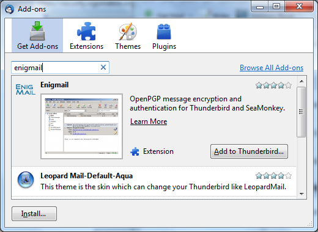
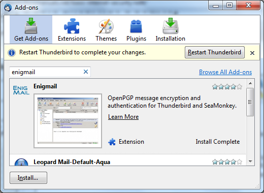

Instalación de PGP en Windows
=============================

Para complicar un poco las cosas, varios programas de software utilizan el protocolo PGP para cifrar correo electrónico. Para trabajar con PGP en Thunderbird necesitamos instalar GPG - una implementación libre de PGP *y* Enigmail - una extensión de Thunderbird que le permite utilizar GPG ... ¿Confundido? No se preocupe por eso, todo lo que tiene que saber es cómo cifrar su correo electrónico con PGP y para eso, necesita instalar a *ambos*, GPG y Enigmail. Ahora explicaremos como hacerlo...

Instalación de PGP (GPG) en Microsoft Windows
--------------------------------------------

Para enviar mensajes cifrados con PGP o para firmarlos, necesitamos el software GNU Privacy Guard (GnuPG). Es necesario instalarlo antes de hacer cualquier tipo de cifrado.

Vaya a la página web del proyecto [Gpg4win](http://gpg4win.org/)

En la parte izquierda de la página, encontrará el enlaces a la sección 'Descargar'. Haga click en él.

Esto le llevará a una página donde se puede descargar Gpg4Win. Haga clic en el botón que le ofrece la última versión estable (no beta).

Esto descargará un archivo .exe. Dependiendo de su navegador, es posible que tenga que hacer doble clic en el archivo descargado (que se llamará algo así como `gpg4qin-2.1.0.exe`) antes de que algo suceda. Windows le preguntará si está seguro de que desea instalar este programa. Conteste sí.

Luego complete la instalación, aceptando la licencia, seleccionando el idioma apropiado y aceptando las opciones por defecto haciendo clic en 'Next', a menos que tenga una razón para no hacerlo.

El programa de instalación le preguntará dónde colocar la aplicación en su computadora. La configuración por defecto debería estar bien, pero tome nota de ella porque es posible que la necesitemos más. Haga clic en "Siguiente" cuando esté de acuerdo.
 

Instalación con la extensión Enigmail
-------------------------------------

Después de haber instalado correctamente el software **PGP** como hemos descrito anteriormente, ahora está listo para instalar el complemento **Enigmail**.

Enigmail es un complemento de Firefox que le permite proteger la privacidad de sus mensajes de correo electrónico. Enigmail es simplemente una interfaz que le permite utilizar el cifrado PGP desde dentro de Thunderbird.

Enigmail se basa en la criptografía de clave pública. En este método, cada individuo debe generar su propio par de claves personales. La primera clave se conoce como la clave privada. Debe estar protegida por una contraseña o frase de acceso, guardada en un lugar secreto y nunca debe compartirse con nadie.

La segunda clave es conocida como la clave pública. Esta clave puede ser compartida con alguno de sus contactos. Una vez que tenga la clave pública del destinatario puede comenzar a enviar mensajes de correo electrónico cifrados a esta persona. Sólo ella será capaz de descifrar y leer sus correos electrónicos, porque ella es la única persona que tiene acceso a la clave privada coincidente.

Del mismo modo, si usted envía una copia de su clave pública propia a sus contactos de correo electrónico y mantiene la correspondiente clave privada en secreto, sólo usted podrá leer los mensajes cifrados de esos contactos.

Enigmail también permite adjuntar firmas digitales a sus mensajes. El destinatario del mensaje que tiene una copia original de su clave pública podrá verificar que el correo electrónico proviene de usted, y que su contenido no ha sido alterado en el camino. Del mismo modo, si usted tiene la clave pública del destinatario, puede verificar las firmas digitales en sus mensajes.

Pasos para la instalación
-------------------------

Para empezar a instalar Enigmail, lleve a cabo los siguientes pasos:

 1. Abra **Thunderbird**, luego `Select tools > Add-ons` para activar la ventana de complementos, por defecto aparecerá habilitado el panel *Get add-ons*.

 2. Ingrese enigmail en la barra de búsqueda, como abajo, y haga click en el ícono de búsqueda.

 

 3. Simplemente haga click en el botón 'Add to Thunderbird' para iniciar la instalación.

 4. Thunderbird le preguntará si está seguro de que desea instalar este complemento. Confiamos en esta aplicación por lo que debemos hacer click en el botón 'Install now'.

 

 5. Después de algún tiempo, la instalación se completará y la siguiente ventana debe aparecer. Por favor, haga click en el botón 'Restart Thunderbird'.

 

