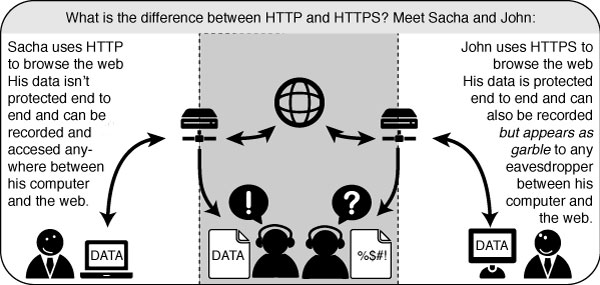
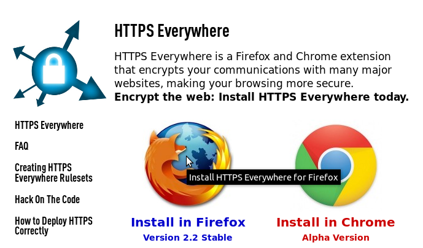
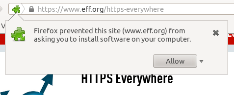
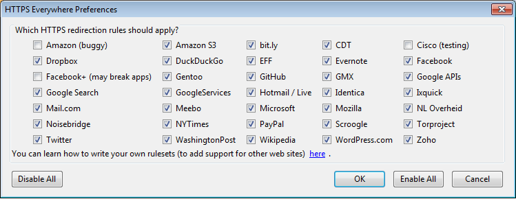
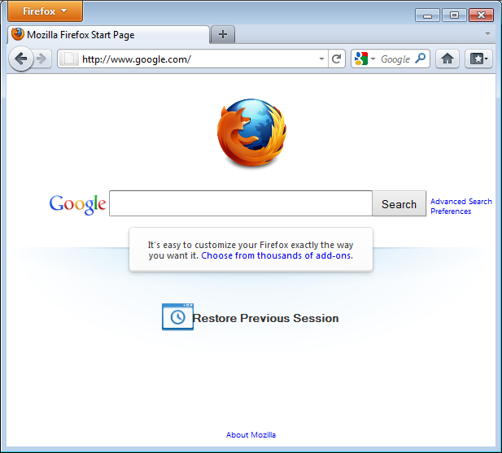
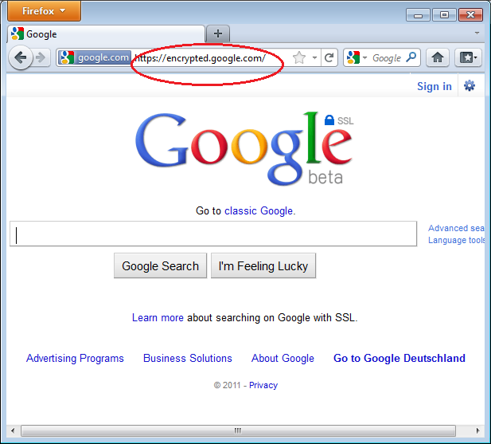
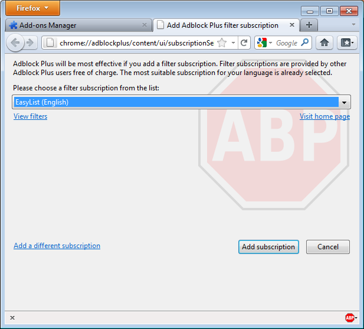

Extensiones de Firefox
======================

La primera vez que descargue e instale Firefox, puede manejar las tareas básicas del navegador inmediatamente. También puede agregar capacidades adicionales o cambiar la forma en que se comporta con la instalación de complementos, pequeños añadidos que extienden el poder de Firefox.

Las extensiones de Firefox optimizan su navegador, pero también pueden recoger y transmitir información sobre usted. Antes de instalar cualquier complemento, tenga en cuenta elegir los complementos a partir de fuentes confiables. De lo contrario, un complemento puede enviar información acerca de usted sin que usted lo sepa, mantener un registro de los sitios que ha visitado, o incluso dañar el equipo.

Hay varios tipos de complementos:

 * *Extensiones* que agregan funcionalidad a Firefox
 * *Temas* que permiten cambiar la apariencia de Firefox.
 * *Plugins* que ayudan a Firefox manejar las cosas que normalmente no puede procesar (por ejemplo, películas Flash, aplicaciones Java).

Para los temas que se tratan en este libro sólo vamos a necesitar extensiones. Vamos a ver algunos complementos que son particularmente importantes para hacer frente a la seguridad en Internet. La variedad de extensiones disponibles es enorme. Puede añadir diccionarios de diferentes idiomas, realizar el seguimiento del clima en otros países, obtener sugerencias de los sitios web que son similares a la que usted está viendo en ese momento, y mucho más. Firefox mantiene una lista de las extensiones actuales disponibles en ([https://addons.mozilla.org/firefox](https://addons.mozilla.org/firefox)); también puede buscar por categoría en [https://addons.mozilla.org/firefox/browse](https://addons.mozilla.org/firefox/browse).

**Atención**: Nosotros le recomendamos que nunca instale un complemento si no está disponible en la página de complementos de Firefox. Usted nunca debe instalar Firefox a menos que obtenga los archivos de instalación de una fuente de confianza. Es importante tener en cuenta que el uso de Firefox en el ordenador de alguien o en un café con Internet aumenta su vulnerabilidad potencial. Sepa que usted puede tener Firefox en un CD o en una memoria USB (consulte el capítulo sobre este tema).

Si bien ningún instrumento puede protegerlo completamente contra todas las amenazas a su privacidad y seguridad en línea, las extensiones de Firefox que se describen en este capítulo pueden reducir significativamente su exposición a las más comunes, y aumentar sus posibilidades de permanecer en el anonimato.

HTTPS Everywhere
----------------

HTTP es considerada insegura, porque la comunicación se transmite en texto plano. Muchos sitios en la Web ofrecen algún soporte para el cifrado HTTPS, pero es difícil de usar. Por ejemplo, pueden conectarse a HTTP de forma predeterminada, incluso cuando HTTPS está disponible, o pueden llenar las páginas cifradas con vínculos que se remontan al sitio sin cifrar. La extensión HTTPS Everywhere soluciona estos problemas al volver a escribir todas las solicitudes a estos sitios a HTTPS. Aunque la extensión se llama "HTTPS Everywhere", sólo se activa HTTPS en una lista particular de sitios y sólo pueden utilizar HTTPS en los sitios que han decidido apoyarlo. No se puede hacer la conexión a un sitio seguro si ese sitio no ofrece HTTPS como opción.

Por favor, tenga en cuenta que algunos de estos sitios todavía incluyen una gran cantidad de contenido, como imágenes o íconos, de dominios de terceros que no están disponibles a través de HTTPS. Como siempre, si el ícono de la cerradura del navegador está roto o tiene un signo de exclamación, es posible que sigan siendo vulnerables a algunos adversarios que usan ataques activos o análisis de tráfico. Sin embargo, el esfuerzo que se requiere para controlar su navegación será mucho mayor.

Algunos sitios web (como Gmail) proporcionan soporte HTTPS automáticamente, pero utilizar HTTPS Everywhere también lo protegerá de ataques de eliminación de TLS/SSL, en los que un atacante oculta la versión HTTPS del sitio desde su computadora si en un inicio se intenta acceder a la versión HTTP.

Información adicional se puede encontrar en su [https://www.eff.org/https-everywhere](https://www.eff.org/https-everywhere).

Instalación
------------

Primero, descargue la extensión HTTPS Everywhere desde el sitio web oficial [https://www.eff.org/https-everywhere](https://www.eff.org/https-everywhere)

Seleccione la versión más nueva. En el ejemplo debajo, usamos la versión 2.2 de HTTPS Everywhere. (Podría estar disponible una versión más nueva en este momento.)

Haga click en "Allow". Tendrá que reiniciar Firefox pulsando el botón "Restart Now". HTTPS Everywhere está instalado.

Configuración
-------------

Para acceder al panel de configuración de HTTPS Everywhere en Firefox 4 (GNU/Linux), haga click en el menú Tools en la parte superior de su pantalla y luego seleccione complementos. (Observe que en diferentes versiones de Firefox y en diferentes sistemas operativos, el administrador de complementos puede estar en diferentes lugares en la interfaz.)

Haga click en el botón Preferences.

Se mostrará una lista de todos los sitios web soportados donde las reglas de redirección de HTTPS pueden aplicarse. Si tiene problemas con una regla específica de redirección, puede desmarcarla aquí. En este caso, HTTPS Everywhere no modificará su conexión con el sitio específico.

Uso
---

Una vez habilitado y configurado, HTTPS Everywhere es muy fácil y transparente para usar. Tipee una URL como HTTP insegura (por ejemplo, [http://www.google.com](http://www.google.com)).

Presione Enter. Será redirigido automáticamente al sitio web seguro HTTPS cifrado (en este ejemplo: [https://encrypted.google.com](https://encrypted.google.com)). No se necesita ninguna otra acción.

Si las redes bloquean HTTPS
---------------------------
Su operador de red puede decidir bloquear las versiones seguras de los sitios web para aumentar su capacidad de espiar qué es lo que usted hace. En tales casos, HTTPS Everywhere puede advertirlo de usar estos sitios porque usted puede forzarlo para que nunca use las versiones inseguras. (Por ejemplo, sabemos acerca de una red wifi de un aeropuerto donde todas las conexiones HTTP estaban permitidas, pero no las HTTPS. Quizás los operadores WiFi estaban interesados en ver que hacían los usuarios. En el aeropuerto, los usuarios con HTTPS Everywhere no podrán navegar por determinados sitios web a menos que deshabiliten temporariamente HTTPS Everywhere.)

En este escenario, usted debería elegir usar HTTPS Everywhere junto con una tecnología de evasión tal como Tor o una VPN para eludir a la red que está bloqueando el acceso seguro a los sitios web.

Añadir soporte para sitios adicionales en HTTPS Everywhere
----------------------------------------------------------

Usted puede agregar sus propias reglas a HTTPS Everywhere para sus sitios web favoritos. Puede encontrar cómo hacer esto en el siguiente [https://www.eff.org/https-everywhere/rulesets](https://www.eff.org/https-everywhere/rulesets). El beneficio de añadir reglas es que ellas le enseñan a HTTPS Everywhere cómo asegurarse que su acceso a estos sitios sea seguro. Pero recuerde: HTTPS Everywhere no le permitirá acceder a sitios seguros a menos que los operadores de los sitios hayan elegido ponerlos disponibles a través de HTTPS. Si un sitio no soporta HTTPS, no tendrá ningún beneficio añadir una regla para él.

Si usted administra un sitio web y dispone de una versión HTTPS del sitio disponible, una buena práctica sería la de presentar su sitio web al lanzamiento oficial de HTTPS Everywhere.

Forzando conexiones seguras sobre servidor HTTPS
------------------------------------------------

Aún cuando usted le de instrucciones a su navegador para que use el protocolo HTTPS cuando se comunique con un servidor web, es posible que el servidor (debido a una configuración insegura de su lado) fuerce a un protocolo cifrado SSL inseguro para la conexión. La única forma de prevenir es diciéndole al navegador que no acepte dichos protocolos inseguros SSL (como aquellos basados en cifrado RC4).

Para deshabilitar el cifrado RC4 para las conexiones HTTPS haga lo siguiente. En la barra de direcciones vacía tipee "about:config", presione enter y cierre la ventana de diálogo de precaución que aparece (puede deshabilitar este diálogo si lo desea la próxima vez que configure Firefox). En el campo de búsqueda ingrese "rc4" y observe la lista desplegada como resultado de su búsqueda:

Una entrada con un "true" en la última columna (campo "Value") estará activa, debe desactivarla. Simplemente, con un click derecho en la entrada y cambie el valor a false. Proceda de la misma forma para todas las entradas.

Adblock Plus
------------

Adblock Plus ([http://www.adblockplus.org](http://www.adblockplus.org)) es conocido principalmente por bloquear publicidad en los sitios web. Pero también se puede usar para bloquear otro contenido que intente rastrearlo. Para mantenerse actualizado con las últimas amenazas, Adblock Plus depende de las listas negras mantenidas por voluntarios.

Información extra para Geeks: ¿Cómo bloquea direcciones Adblock Plus?

El trabajo duro aquí está hecho realmente por Gecko, el motor sobre al cual se construyen aplicaciones tales como Firefox, Thunderbird y otros. Permiten lo se conoce como "políticas de contenido". Una política de contenido no es más que un objeto JavaScript (o C++) que se llama cada vez que el navegador tiene que cargar algo. A continuación, puede ver la dirección que debe cargarse y algunos otros datos y decidir si se debe permitir o no. Existe una serie de directivas integradas de contenido (cuando usted define a qué sitios no se les debe permitir cargar las imágenes en Firefox o SeaMonkey, en realidad se está configurando una de estas políticas de contenido integrado) y ninguna extensión puede registrar alguna. Así que todo lo que Adblock Plus tiene que hacer es registrar su política de contenidos, aplicar una lógica para decidir qué direcciones bloquear e implementar la interfaz de usuario para permitir la configuración de los filtros. 

Comenzando con Adblock Plus
---------------------------

Una vez que está instalado Firefox:

 1. Descargue la última versión de Adblock Plus desde la base de datos de los complementos de Firefox.
 2. Confirme que quiere instalar Adblock haciendo click en "Install Now".
 3. Después que Adblock Plus se ha instalado, Firefox se reiniciará.

Elección de una suscripción a un filtro
---------------------------------------

Adblock Plus por sí mismo no hace nada. Puede ver cada elemento que un sitio web intenta cargar, pero no sabe a cuál bloquear. Para eso están los filtros de Adblock's. Después de reiniciar Firefox, se le pedirá que elija una suscripción a un filtro (gratuita).

¿Cuál elegir? Adblock Plus ofrece algunos en un menú desplegable y posiblemente usted quiera saber algo acerca de las fortalezas y debilidades de cada uno. Un buen filtro para comenzar a proteger su privacidad es EasyList (también disponible en [http://easylist.adblockplus.org/en](http://easylist.adblockplus.org/en)).

Por muy tentador que pueda parecer, no se suscriba a demasiados filtros, ya que algunos pueden superponerse, lo que resulta en resultados inesperados. EasyList (principalmente dirigido a sitios en idioma inglés) funciona bien con otras  extensiones EasyList (tales como extensiones específicas de la región, como las listas de RuAdList o listas temáticas como EasyPrivacy). Pero choca con la lista de Fanboy (otra lista con foco principal en sitios en idioma inglés).

Usted puede cambiar sus suscripciones de filtro en cualquier momento. Una vez hechos sus cambios, haga click en OK.

Creación de filtros personalizados
----------------------------------

AdBlock Plus también le permite crear sus propios filtros, si así lo desea. Para agregar un filtro, vaya a las preferencias de Adblock Plus preferencias y haga clic en "Add Filter" en la esquina inferior izquierda de la ventana. Los filtros personalizados no pueden reemplazar los beneficios de las listas negras bien mantenidas como EasyList, pero son muy útiles para bloquear el contenido específico que no está cubierto en las listas públicas. Por ejemplo, si desea evitar la interacción con Facebook en otros sitios web, puede agregar el siguiente filtro:

    ||facebook.*$domain=~facebook.com|~127.0.0.1

La primera parte (`||facebook.*`) bloqueará inicialmente todo lo que venga desde el dominio de Facebook. La segunda parte (`$domain=~facebook.com|~127.0.0.1`) es una excepción que le dice al filtro que permita solicitudes de Facebook solamente cuando usted está en Facebook o si sus solicitudes de Facebook proceden desde 127.0.0.1 (su propia computadora) para mantener ciertas características de Facebook trabajando.

Puede encontrar una guía acerca de cómo crear sus propios filtros en [http://adblockplus.org/en/filters](http://adblockplus.org/en/filters).

Habilitación y deshabilitación de AdBlock Plus para elementos o sitios web específicos
--------------------------------------------------------------------------------------

Usted puede ver los elementos identificados por AdBlock Plus pulsando en el ícono ABP de AdBlock Plus en su navegador (habitualmente cerca de la barra de búsqueda) y seleccionar "Open blockable items". Una ventana abajo en su navegador habilitará o deshabilitará cada elemento de la base caso por caso. Alternativamente, puede deshabilitar AdBlock Plus para un dominio o una página específica haciendo click en el ícono ABP y marcando la opción "Disable on [nombre del dominio]" o "Disable on this page only".

Otras extensiones que pueden mejorar su seguridad
-------------------------------------------------

Debajo hay una breve lista de extensiones que no están cubiertas en este libro y son de gran ayuda para su protección.

 * **Flagfox** - pone una bandera en la barra de localización que le informa el lugar más probable en donde se encuentre el servidor web que hospeda la página web que está visitando [https://addons.mozilla,org/en-US/firefox/addon/flagfox/](https://addons.mozilla.org/en-US/firefox/addon/flagfox/)

 * **BetterPrivacy** - administra las "cookies" usadas para rastreaslo mientras visita sitios web. Las cookies son pequeñas cantidades de información almacenada en su navegador. Algunas de ellas son usadas por los publicistas para rastrear los sitios que usted visita. [https://addons.mozilla.org/en-US/firefox/addon/betterprivacy/](https://addons.mozilla.org/en-US/firefox/addon/betterprivacy/)

 * **GoogleSharing** - Si le preocupa que Google conozca su historial de búsqueda, esta extensión lo ayudará a evitarlo [https://addons.mozilla.org/en-US/firefox/addon/googlesharing/](https://addons.mozilla.org/en-us/firefox/addon/googlesharing/)

 * **NoScript** - Aunque no es demasiado amigable para los principiantes, este complemento bloqueará los scripts y el contenido de los plugins de terceras partes (por ejemplo, Adobe Flash) a menos de que usted se lo permita específicamente, también brinda una protección general contra simples vectores de cross site scripting [http://noscript.net](http://noscript.net)

 * **User Agent Switcher** - Su navegador envía gran cantidad de información a cualquier servidor remoto a través del encabezado 'User-Agent', incluyendo su sistema operativo e información específica sobre su versión. Este complemento le permite a usted falsificar dicha información o enviar un User-Agent genérico al servidor. [http://chrispederick.com/work/user-agent-switcher/](http://chrispederick.com/work/user-agent-switcher/)

